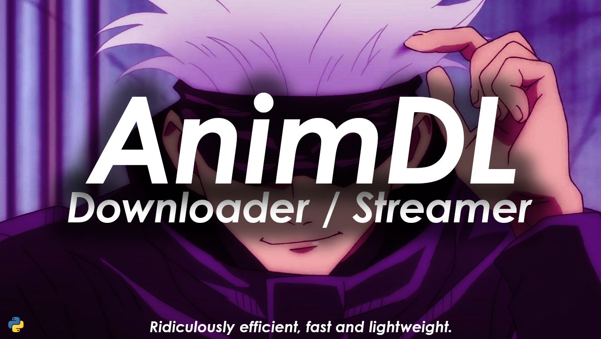

Welcome to AnimDL
===========================

A highly efficient, fast, powerful and light-weight anime downloader and streamer for your favorite anime.

**Features:**

- Abuses the developer's knowledge of internal streaming mechanisms in various different sites to hunt down high quality stream links.
- Doesn't make a single unnecessary request; the official site may make 1k requests, this tool makes 3~5.
- Doesn't use any heavy dependencies such as Selenium or Javascript Evaluators.
- Effectively bypasses DRMs in several streaming sites.
- Integrates powerful, fast and efficient internal HLS downloader.
- Only tool in existence to bypass 9Anime's cloudflare protection.
- Operates with full efficiency and speed by using Python's generator functions to their full capacity.
- Supports downloading with Internet Download Manager optionally.
- Supports optional downloading with ffmpeg (see Using ffmpeg).
- Supports streaming with mpv, iina and vlc (see Streaming)

Getting started
-----------------

Lorem Ipsum

Meta
------

If you're looking for something related to the project itself, it's here.

.. toctree::
  :maxdepth: 1

  whats_new
  version_guarantees
  migrating
